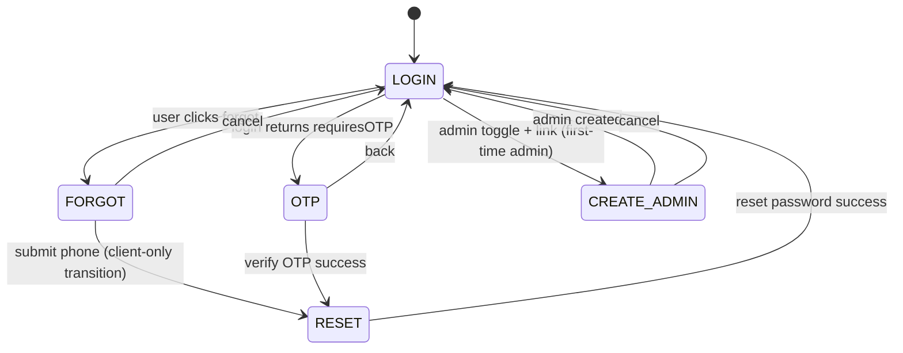

# Auth feature (`src/features/auth`)

This document describes the **folder structure**, **runtime workflow**, and **processes** for the investor portal’s authentication UI and client-side auth helpers.

---

## 1. Purpose

The `auth` feature provides:

- The **login surface** at route `/` (`LoginPage`).
- **API wrappers** for login, OTP verification, password reset, and admin registration.
- **React Query mutations** (`useLogin`, `useVerifyOtp`, `useResetPassword`, `useCreateAdmin`).
- A **Zustand store** (`useAuthStore`) for lightweight global auth flags and user snapshot.
- Shared **toast notifications** (`notify`) reused across the app.

> **Note:** The app also wraps routes in `AuthProvider` (`src/Context/AuthContext.js`), which maintains a separate React-context auth state (cookies + user/admin JSON cookies). The **current** login path used by `LoginPage` is the feature’s **`useLogin`** hook, not `AuthContext.login`. Both layers read the same cookie names for token and user type where applicable; see [§7](#7-cookies-storage-and-api-client).

---

## 2. Directory structure

```
src/features/auth/
├── AUTH.md                 ← this file
├── index.js                ← public exports (store, LoginPage, useLogin)
├── api/
│   ├── login.js            ← POST user or admin login
│   ├── verifyOtp.js        ← POST verify OTP
│   ├── resetPassword.js    ← POST reset password
│   └── createAdmin.js      ← POST admin register
├── hooks/
│   ├── useLogin.js         ← mutation: cookies + Zustand + navigate
│   ├── useVerifyOtp.js     ← mutation: verify OTP only
│   ├── useResetPassword.js ← mutation: reset + notify on success
│   └── useCreateAdmin.js   ← mutation: register + notify on success
├── stores/
│   └── authStore.js        ← Zustand + persist (partial: userType)
├── constants/
│   └── views.js            ← AUTH_VIEWS + VIEW_TITLES (Arabic titles)
├── utils/
│   └── notify.js           ← react-notifications-component helper
├── pages/
│   └── LoginPage.jsx       ← orchestrator: views, reducer, handlers
└── components/
    ├── AuthToggle.jsx      ← user vs admin mode on login
    ├── LoginForm.jsx
    ├── OtpForm.jsx
    ├── ForgotForm.jsx
    ├── ResetForm.jsx
    ├── CreateAdminForm.jsx
    ├── FieldError.jsx
    ├── PasswordInput.jsx
    └── Spinner.jsx
```

---

## 3. Architectural layers

| Layer | Role |
|--------|------|
| **`api/`** | Thin functions: `api.post(...)` from `src/lib/api.js`, return `data` from responses. No React. |
| **`hooks/`** | `@tanstack/react-query` `useMutation` wrappers; side effects (cookies, navigate, `notify`, Zustand). |
| **`stores/authStore.js`** | `user`, `isAuthenticated`, `userType`, `isLoading`, `error`; `setUser`, `logout`, `checkAuth` (cookie sniff). |
| **`pages/LoginPage.jsx`** | Single page, **local `useReducer`** for form fields, active **view**, loading/error strings; composes hooks + forms. |
| **`constants/views.js`** | Enum-like view keys and section titles. |
| **`utils/notify.js`** | Cross-app toast API. |

---

## 4. View state machine (`LoginPage`)

`LoginPage` does **not** use one global store for every field. It uses `AUTH_VIEWS` and a reducer with actions: `SET`, `MERGE`, `SET_VIEW`, `SET_ERROR`, `SET_LOADING`.



- **LOGIN:** `LoginForm` + optional `AuthToggle` (investor vs admin). Admin mode shows link to **CREATE_ADMIN**.
- **OTP:** Shown when `handleLogin` receives `result?.requiresOTP` from `loginMutation.mutateAsync` (see [§5.1](#51-login-success-path)).
- **FORGOT / RESET:** Password recovery UI; forgot flow moves to reset with `tempPhone` stored in page state.
- **CREATE_ADMIN:** First-time admin registration; on success, pre-fills login email and returns to LOGIN.

`i18n`: on mount / language change, `document.documentElement` `dir` and `lang` are set from `i18n.language` (defaults toward Arabic RTL).

---

## 5. Processes and workflows

### 5.1 Login (success path)

1. User submits credentials on **LOGIN** (`handleLogin`).
2. `useLogin().mutateAsync({ credentials, isAdmin })` calls `loginUser` in `api/login.js`:
   - **User:** `POST /portallogistice/login` with `{ login, password }`.
   - **Admin:** `POST /portallogistice/admin/login` with `{ email, password }`.
3. **`useLogin` `onSuccess`** (when `data.success`):
   - Sets HTTP cookies (30 days): `portal_logistics_token`, `portal_logistics_user_type` (`user` | `admin`), with `Secure` and `SameSite=Strict`.
   - Calls `setUser(data.data.user, 'admin' | 'user')` on Zustand.
   - `notify('مرحباً بك!', ...)`.
   - `navigate('/admin' | '/dashboard', { replace: true })`.

**OTP branch:** In `LoginPage`, if the resolved mutation result includes `requiresOTP`, the page switches to **OTP** and stores `tempPhone`. In **`useLogin`**, the code path that would return `{ requiresOTP, phone }` from `onSuccess` is **commented out**; OTP on login therefore depends on `mutateAsync` actually returning that shape from the mutation function / React Query behavior. If the backend signals OTP only inside `onSuccess` without returning it to the caller, the UI OTP step may not trigger until that wiring is aligned.

### 5.2 Verify OTP

- **OTP** view: `handleVerifyOtp` → `useVerifyOtp().mutateAsync({ phone, otp })` → `POST /portallogistice/verify-otp`.
- On success, page moves to **RESET** (password + confirmation).

### 5.3 Forgot password (UI flow)

- **FORGOT:** collects phone/email identifier; `handleForgot` only validates presence, then sets view to **RESET** and copies value into `tempPhone` (no API call in that step in the current code).

### 5.4 Reset password

- **RESET:** `handleReset` validates match and minimum length, then `useResetPassword().mutateAsync` → `POST /portallogistice/reset-password` with `phone`, `password`, `password_confirmation`.
- `LoginPage` shows success via `notify` and returns to **LOGIN**. `useResetPassword` also fires `notify` in its `onSuccess`.

### 5.5 Create admin (first-time)

- From **LOGIN** in admin mode, link opens **CREATE_ADMIN**.
- `handleCreateAdmin` → `useCreateAdmin().mutateAsync` → `POST /portallogistice/admin/register` with `name`, `email`, `password`.
- On success: back to **LOGIN** with `login` prefilled to the new admin email.

### 5.6 Logout (Zustand)

`authStore.logout()` clears the two portal cookies and resets Zustand user fields. Components that rely on **`AuthContext`** for session should use context `logout` for server-side logout and full cookie cleanup (`portal_logistics_user` / `portal_logistics_admin`).

---

## 6. Zustand store (`authStore.js`)

- **State:** `user`, `isAuthenticated`, `userType`, `isLoading`, `error`.
- **`persist`** (localStorage key `auth-storage`): **`partialize`** persists only **`userType`** (not tokens).
- **`checkAuth`:** Reads `portal_logistics_token` and `portal_logistics_user_type` from `document.cookie`; if both exist, sets `isAuthenticated` and `userType`. Does not validate the token with the backend.
- **`logout`:** Expires token and user-type cookies client-side and clears store fields.

---

## 7. Cookies, storage, and API client

| Mechanism | Responsibility |
|-----------|------------------|
| **`src/lib/api.js`** | Axios instance with `API_BASE_URL`. Request interceptor: reads **`portal_logistics_token`** from `document.cookie`, sets `Authorization: Bearer …`, sets `X-LANG`. Response interceptor: on **401**, clears token cookie and `window.location.href = '/'`. |
| **`useLogin`** | Writes token + user type cookies used by `lib/api`. |
| **`src/utils/api.js`** | Default axios + **401** handler clears **localStorage** token keys and redirects; used by code paths that use raw axios defaults, not necessarily the same as cookie-only auth. |
| **`AuthContext`** | Also uses `portal_logistics_token` / `portal_logistics_user_type` and optionally **`portal_logistics_user`** / **`portal_logistics_admin`** JSON cookies for restored profile. |

After login via **`useLogin`**, if nothing else sets `portal_logistics_user` / `portal_logistics_admin`, context may still mark the user authenticated from the token but with missing parsed user object until another flow sets those cookies.

---

## 8. Public exports (`index.js`)

```text
useAuthStore      → from ./stores/authStore
LoginPage         → default from ./pages/LoginPage
useLogin          → from ./hooks/useLogin
```

Other hooks and `notify` are imported by path from other features (e.g. `../../auth/utils/notify`).

---

## 9. App routing integration

- **`src/index.js`:** `<Route path="/" element={<LoginPage />} />` is the public entry.
- **`DashboardLayout`** / **`AdminLayout`** are currently mounted **without** `ProtectedRoute` (wrappers are commented in routes), so route protection is effectively **cookie + API 401** driven rather than React guards.

---

## 10. Dependencies (feature-level)

- **React** (hooks, reducer), **react-router-dom** (`useNavigate` in `useLogin`), **@tanstack/react-query**, **zustand** + **persist**, **react-i18next** (in `LoginPage`), **react-notifications-component** (via `notify`; `ReactNotifications` mounted in `index.js`).

---

## 11. Extension checklist

When changing auth behavior, consider touching:

1. `api/*.js` — endpoint paths and payloads.
2. Matching **`AuthContext`** if other screens still use `useAuth().login` / `logout`.
3. **`lib/api.js`** 401 behavior vs **`utils/api.js`** interceptor.
4. **`ProtectedRoute`** if re-enabled, so it stays consistent with cookie and context state.
5. **`useLogin` `onSuccess`** if OTP or first-login should drive `LoginPage` without race conditions between `onSuccess` and `mutateAsync` return value.

---

*Generated from the codebase layout and files under `src/features/auth` and related global auth wiring.*
